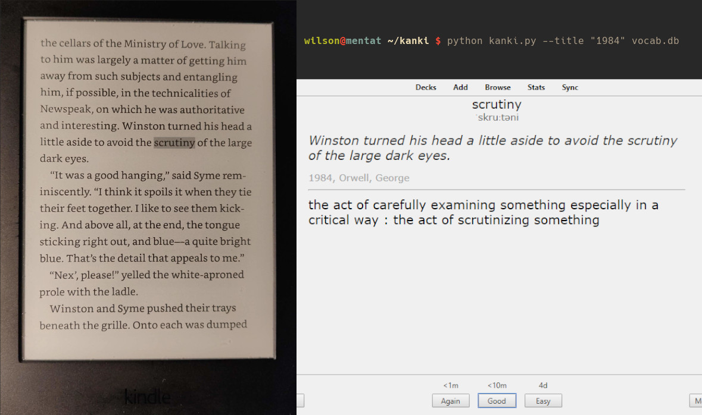
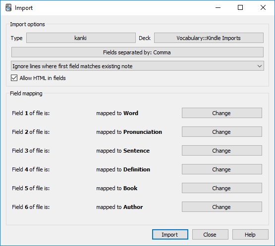

# kanki
kanki is a command line utility for exporting and finding definitions of words looked up in Kindle to the flashcard program [Anki](https://apps.ankiweb.net/). Every word you highlight while reading will be stored in a file on your Kindle called `vocab.db`, which kanki uses. Definitions are provided by Meriam-Webster's Learner's Dictionary.



## How to use
```
usage: kanki.py [-h] [-b] [-t TITLE] db_path

positional arguments:
  db_path               the path to the vocabulary database

optional arguments:
  -h, --help            show this help message and exit
  -b, --books           list books in vocabulary file
  -t TITLE, --title TITLE
                        the title of the book to export
```

kanki uses python and [Requests](https://requests.readthedocs.io/en/master/) so first make sure you have those installed eg. by running `pip install requests`.

- Clone the repository
```
git clone https://github.com/wjohnsson/kanki.git
```

- If it's the first time you use kanki you must first [import the kanki card type](#import-kanki-card-type).

- Plug in your Kindle and search for `vocab.db` (mine was in a hidden folder called `system/vocabulary/`).

- run the script, eg. `python kanki.py --title "1984" ./vocab.db`

- kanki will export to a file called `kanki.txt` which you can then import (`file > import...`) to a deck of your choosing. Make sure you have the card type kanki (or whatever you've renamed it to) and have fields separated by comma.



### Import kanki card type
The first time you use kanki you must import the card type so you get the correct fields and formatting. In the Anki deck view press `Import File` and select `kanki.apkg` provided in the repo. This will create a new deck containing one sample card with the kanki card type. 

You can edit the formatting and the name of this card type as you wish, as long as the fields are in the given order.


