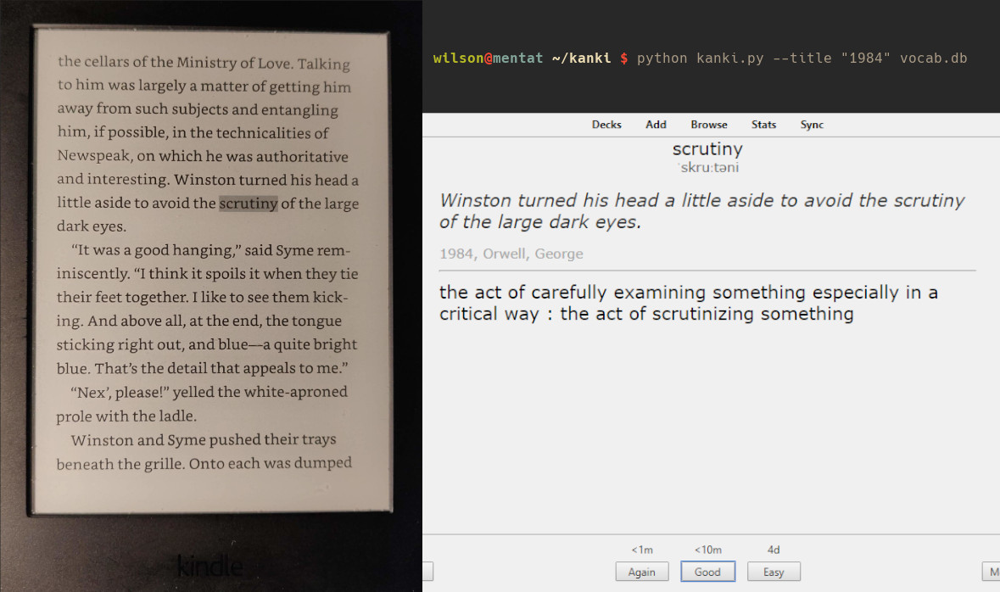
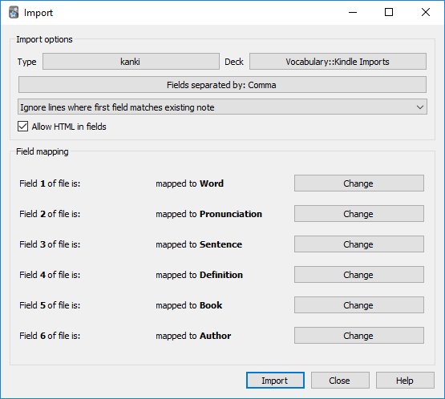

<div id="top"></div>

# kanki
Kindle → Anki

kanki is a command line utility designed to help language learners improve their vocabulary. It finds the definitions
for all words highlighted while reading on Kindle and exports to the flashcard program [Anki](https://apps.ankiweb.net/).
For this, kanki uses the SQLite database of highlighted words stored on your Kindle and definitions provided by the
Meriam-Webster's Learner's Dictionary API.



## Dependencies
- [Python 3.8+](https://www.python.org/downloads/)
- [Poetry](https://python-poetry.org/docs/#installation)

To download the remaining python package dependencies run:
```shell
poetry install
```

kanki is known to work with Kindle Paperwhite 3 and flashcards can be imported to Anki 2.1.x.

## Usage
```
usage: kanki [-h] [-l] [-t TITLE [TITLE ...]] [-i ID [ID ...]] [-p DB_PATH] [-k KEY] [-w WORD]

optional arguments:
  -h, --help            show this help message and exit
  -l, --list            list books in vocabulary file
  -t TITLE [TITLE ...], --title TITLE [TITLE ...]
                        the title(s) of the book(s) to export
  -i ID [ID ...], --id ID [ID ...]
                        the id(s) of the books(s) to export
  -p DB_PATH, --db_path DB_PATH
                        the path to the vocabulary database (default: ./vocab.db)
  -k KEY, --key KEY     your Merriam-Webster's Learner's Dictionary API key
  -w WORD, --word WORD  a single word to look up in the dictionary.
```

1. Create an account on [Merriam Webster's Developer Center](https://www.dictionaryapi.com/) to generate an API key to
   the Learner's Dictionary.
2. Plug in your Kindle and search for `vocab.db` (mine was in the hidden folder `system/vocabulary`). Copy it to the
   root of this repository.
3. List available books
````shell
poetry run kanki --list
````
4. For example, to extract all words looked up in the books _Dune_ and _Hello World_, run:
````shell
poetry run kanki --title "Dune" "Hello World" --key "your-api-key"
````

5. kanki will export to the file `kanki_export.txt` which you can then [import to Anki](#anki-import-reference) (
   using `File > Import...`) to a deck of your choosing. 
   - Use the card type kanki, select _"Fields separated by: Comma"_ and _"Allow HTML in fields"_.
   - If it's the first time you use kanki you must first [import the kanki card type](#import-kanki-card-type-into-anki)
     into Anki.

Unfortunately, some words looked up may be missing from the dictionary. These will be written to `kanki_failed_words.txt`.

### Import kanki card type into Anki
The first time you use kanki you must import the card type, in order to get the correct fields and formatting.
In the Anki deck view press `Import File` and select `kanki_deck_settings.apkg` provided in this repository.
You can now edit the styling and the name of this card type as you wish.

### Anki import reference


<p align="right">(<a href="#top">back to top</a>)</p>
